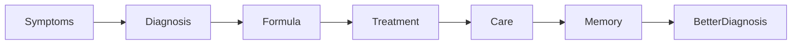
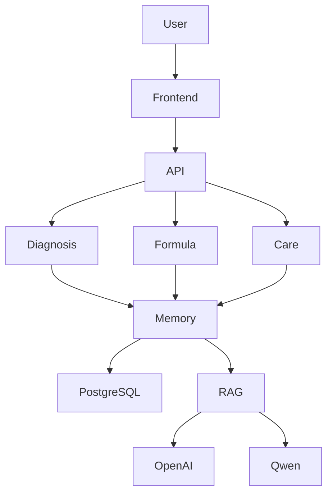

# Xerbs OS

<p align="center">


</p>

<h2 align="center">The AI Operating System for Personalized Herbal Healthcare</h2>

<p align="center">
From diagnosis to personalized herbal treatment, continuous care, and lifelong Health Memory.
</p>

---

<p align="center">

</p>

## Why Xerbs?

Healthcare today is fragmented.

- AI assistants answer questions.
- Electronic health records store information.
- Treatment plans rarely improve over time.
- Herbal knowledge is difficult to personalize at scale.

**Xerbs OS unifies diagnosis, formula intelligence, treatment management, and lifelong health memory into one continuous care platform.**

---

## Core Engines

| Engine | Responsibility |
| --- | --- |
| 🩺 Diagnosis Engine | AI-powered syndrome differentiation and clinical reasoning |
| 🌿 Formula Engine | Personalized herbal formula generation |
| 📈 Care Engine | Continuous treatment planning and follow-up |
| 🧠 Health Memory Engine | Long-term patient context and learning |

---

## Treatment Lifecycle



> **Every treatment makes the next diagnosis smarter.**

---

## High-Level Architecture



---

## Technology Stack

| Layer | Technology |
| --- | --- |
| Frontend | Vue 3 + TypeScript + Tailwind CSS |
| Backend | FastAPI |
| Database | PostgreSQL |
| Cache | Redis |
| AI | OpenAI / Qwen |
| Knowledge | RAG |
| Deployment | Docker |

---

## Documentation

See the **docs/** directory for:

- Vision
- Product Specification
- Domain Model
- System Architecture
- Database Design
- Backend Architecture
- Frontend Architecture
- AI Architecture
- API Design
- Roadmap
- Security
- Deployment

---

## Repository Structure

```text
xerbs-os/
├── backend/
├── frontend/
├── docs/
├── infra/
├── tests/
├── docker/
├── scripts/
├── README.md
└── docker-compose.yml
```

---

## Roadmap

- Build the Diagnosis Engine
- Complete the Formula Engine
- Launch Health Memory
- Release the first Developer Preview
- Open-source the platform

---

## Contributing

Contributions are welcome after the first public release.

---

## License

Released under the MIT License upon first public release.

---

## Current Status

Xerbs OS is under active development.

The architecture is complete, and implementation of the Diagnosis Engine, Formula Engine, Care Engine, and Health Memory Engine is underway.
