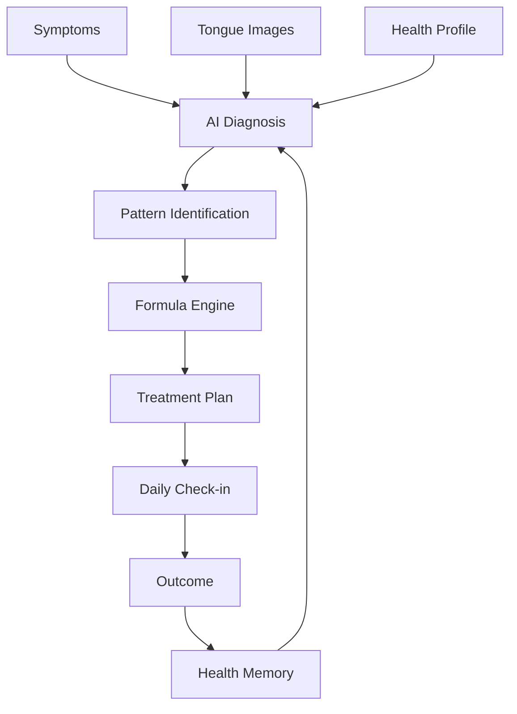

# Xerbs OS

<p align="center">


</p>

<h2 align="center">

The AI Operating System for Personalized Herbal Healthcare

</h2>

<p align="center">

From AI diagnosis to personalized herbal treatment, continuous care, and lifelong Health Memory.

</p>

---

## Table of Contents

- [Why Xerbs?](#why-xerbs)
- [Core Features](#core-features)
- [Treatment Workflow](#treatment-workflow)
- [High-Level Architecture](#high-level-architecture)
- [Technology Stack](#technology-stack)
- [Documentation](#documentation)
- [Repository Structure](#repository-structure)
- [Development Status](#development-status)
- [Roadmap](#roadmap)
- [Design Principles](#design-principles)
- [License](#license)

---

# Why Xerbs?

Modern healthcare is fragmented.

- AI assistants answer questions.
- Electronic health records store information.
- Herbal databases organize knowledge.
- Treatment plans rarely evolve after diagnosis.

**Xerbs combines all of these into one intelligent healthcare operating system.**

Instead of isolated consultations, Xerbs supports the complete treatment lifecycle:

```text
Symptoms

↓

AI Diagnosis

↓

Personalized Formula

↓

Treatment

↓

Daily Follow-up

↓

Health Memory

↓

Continuous AI Improvement
```

---

# Core Features

| Feature | Description | Status |
|----------|-------------|:------:|
| 🤖 AI Diagnosis | AI-powered clinical reasoning | ✅ |
| 👅 Tongue Analysis | Computer vision tongue diagnosis | 🚧 |
| 🌿 Formula Intelligence | Personalized herbal prescriptions | 🚧 |
| 🧠 Health Memory | Long-term personalized health profile | 🚧 |
| 📈 Treatment Tracking | Continuous outcome monitoring | 🚧 |
| 🛡 Safety Analysis | Herb interaction and contraindication checks | 🚧 |
| 📚 Herbal Knowledge Graph | AI retrieval and reasoning | 📅 |
| 🤝 AI Health Coach | Personalized daily coaching | 📅 |

Legend:

- ✅ Completed
- 🚧 In Progress
- 📅 Planned

---

# Treatment Workflow



---

# High-Level Architecture

```mermaid
graph TD

User

↓

Frontend["Vue 3 Frontend"]

↓

API["FastAPI Backend"]

↓

Diagnosis["Diagnosis Engine"]

Formula["Formula Engine"]

Care["Care Engine"]

Memory["Health Memory"]

Diagnosis --> Memory
Formula --> Memory
Care --> Memory

Memory --> PostgreSQL

Memory --> Redis

Memory --> RAG

RAG --> OpenAI

RAG --> Qwen
```

---

# Technology Stack

| Layer | Technology |
|--------|------------|
| Frontend | Vue 3 |
| Language | TypeScript |
| Styling | Tailwind CSS |
| Backend | FastAPI |
| Database | PostgreSQL |
| Cache | Redis |
| ORM | SQLAlchemy |
| Migration | Alembic |
| AI | OpenAI + Qwen |
| Knowledge | RAG |
| Deployment | Docker |

---

# Documentation

## Product

- 📖 [Vision](docs/01-vision.md)
- 🧩 [Product Specification](docs/02-product.md)
- 🧠 [Domain Model](docs/03-domain-model.md)

## Architecture

- 🏛️ [System Architecture](docs/04-system-architecture.md)
- 🗄️ [Database Design](docs/05-database.md)
- ⚙️ [Backend Architecture](docs/06-backend-architecture.md)
- 🎨 [Frontend Architecture](docs/07-frontend-architecture.md)
- 🤖 [AI Architecture](docs/08-ai-architecture.md)
- 🌐 [API Design](docs/09-api.md)
- 🔒 [Security](docs/11-security.md)
- 🚀 [Deployment](docs/12-deployment.md)

## Planning

- 🗺️ [Roadmap](docs/10-roadmap.md)

---

# Repository Structure

```text
xerbs-os/

├── backend/
│
├── frontend/
│
├── docs/
│   ├── README.md
│   ├── 01-vision.md
│   ├── 02-product.md
│   ├── 03-domain-model.md
│   ├── 04-system-architecture.md
│   ├── 05-database.md
│   ├── 06-backend-architecture.md
│   ├── 07-frontend-architecture.md
│   ├── 08-ai-architecture.md
│   ├── 09-api.md
│   ├── 10-roadmap.md
│   ├── 11-security.md
│   ├── 12-deployment.md
│   ├── diagrams/
│   ├── assets/
│   └── adr/
│
├── infra/
│
├── tests/
│
├── .github/
│
├── docker-compose.yml
│
└── README.md
```

---

# Development Status

| Module | Progress |
|----------|:-------:|
| Product Design | ██████████ 100% |
| Domain Model | ██████████ 100% |
| System Architecture | ██████████ 100% |
| Database Design | ██████████ 100% |
| Backend Architecture | ██████████ 100% |
| Frontend Architecture | ██████████ 100% |
| AI Architecture | ██████████ 100% |
| API Design | ████████░░ 80% |
| Security | ███████░░░ 70% |
| Deployment | ██████░░░░ 60% |
| Backend Development | ██░░░░░░░░ 20% |
| Frontend Development | ██░░░░░░░░ 20% |
| AI Engine | █░░░░░░░░░ 10% |

---

# Roadmap

### Phase 1 — Architecture

- Product Design
- Domain Model
- System Architecture
- Database Design

### Phase 2 — Core Platform

- AI Diagnosis
- Formula Engine
- Health Memory
- REST API

### Phase 3 — Intelligent Care

- Daily Treatment Tracking
- AI Health Coach
- Formula Optimization
- Knowledge Graph

### Phase 4 — Ecosystem

- Clinic Platform
- Mobile App
- Public API
- Multi-language Support

---

# Design Principles

- AI-first but clinically grounded
- Personalized treatment over generic recommendations
- Continuous care instead of one-time diagnosis
- Explainable AI decisions
- Long-term Health Memory
- Modular architecture
- Privacy and security by design

---

# License

This project is currently under active development.

The source code will be released under the **MIT License** upon its first public release.

---

# Contributing

Community contributions are welcome after the first public release.

Please review the documentation under the **docs/** directory before submitting issues or pull requests.

---

# Project Status

🚧 Xerbs OS is currently under active development.

The product vision, architecture, database design, backend architecture, frontend architecture, and AI architecture have been completed.

Implementation of the AI diagnosis engine, personalized formula engine, health memory system, and REST API is currently underway.

Our long-term vision is to build the world's leading AI operating system for personalized herbal healthcare.
