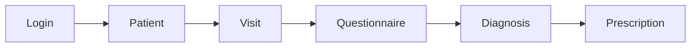

# Xerbs OS

**The AI operating system for personalized herbal healthcare** — from intake to
AI-assisted diagnosis to an AI-generated herbal prescription.

> **Status: Sprint 1 — Release Candidate 1.** The end-to-end clinical workflow
> is implemented and verified. See the
> [Sprint 1 Release Report](docs/product/07-sprint-1-release-report.md).

## Workflow



Each visit collects a questionnaire, an AI **diagnosis** is generated from it
(one is marked *active*), and an AI **prescription** is generated from the active
diagnosis. Diagnoses and prescriptions are immutable; history is preserved.

## Tech stack (as built)

| Concern | Choice |
|---|---|
| Framework | Next.js 16 (App Router, Turbopack), React 19, TypeScript |
| Database | PostgreSQL 16 (Docker) |
| Cache (provisioned) | Redis 7 (Docker) |
| ORM / migrations | Drizzle ORM + drizzle-kit |
| Auth | Better Auth (email/password, cookie sessions) |
| Validation | Zod |
| AI | OpenAI Responses API, behind a provider interface (with a `fake` provider) |
| Tests | Vitest (integration, against real Postgres) |
| Styling | Tailwind CSS v4 |

## Prerequisites

- **Docker Desktop** (for PostgreSQL + Redis)
- **Node.js 20+** and npm

## Setup

```bash
# 1. Install dependencies
npm install

# 2. Configure environment
cp .env.example .env.local
#    Then edit .env.local — set POSTGRES_PASSWORD + a matching DATABASE_URL,
#    a BETTER_AUTH_SECRET (openssl rand -base64 32), and (optionally) an
#    OPENAI_API_KEY. Leave AI_PROVIDER=fake to run without a real key.

# 3. Start Postgres + Redis
npm run db:up

# 4. Apply migrations and seed the demo organization + provider
npm run db:migrate
npm run db:seed

# 5. Run the app
npm run dev        # http://localhost:3000
```

### Signing in

There is no self-service sign-up page in Sprint 1 (Login only); provider
accounts are provisioned out-of-band. To create a login for the demo
organization while the dev server is running:

```bash
# Create a credentialed user
curl -s -X POST http://localhost:3000/api/auth/sign-up/email \
  -H 'Content-Type: application/json' \
  -d '{"name":"Demo Provider","email":"demo@xerbs.example","password":"DemoPass!123"}'

# Grant that user membership in the seeded demo organization
docker exec xerbs-postgres psql -U xerbs -d xerbs -c "INSERT INTO organization_members (organization_id, user_id, role) SELECT o.id, u.id, 'practitioner' FROM organizations o, \"user\" u WHERE o.slug='xerbs-demo-clinic' AND u.email='demo@xerbs.example' ON CONFLICT DO NOTHING;"
```

Then sign in at `/login` with `demo@xerbs.example` / `DemoPass!123`.

## Environment variables

| Variable | Purpose |
|---|---|
| `POSTGRES_USER` / `POSTGRES_PASSWORD` / `POSTGRES_DB` | Postgres container credentials |
| `DATABASE_URL` | Connection string used by Drizzle (must match the three above) |
| `REDIS_URL` | Redis connection (provisioned; unused in Sprint 1) |
| `BETTER_AUTH_SECRET` | Better Auth signing secret |
| `BETTER_AUTH_URL` | Base URL for Better Auth (e.g. `http://localhost:3000`) |
| `AI_PROVIDER` | `openai` or `fake` (deterministic, no network) |
| `OPENAI_API_KEY` / `OPENAI_MODEL` | OpenAI credentials (needed when `AI_PROVIDER=openai`) |

`.env.local` is gitignored and must never be committed.

## Scripts

| Script | Description |
|---|---|
| `npm run dev` | Start the Next.js dev server |
| `npm run build` | Production build |
| `npm run lint` / `npm run typecheck` | ESLint / `tsc --noEmit` |
| `npm run test` | Run the Vitest integration suite |
| `npm run db:up` / `db:down` | Start / stop Postgres + Redis |
| `npm run db:generate` | Generate a Drizzle migration from the schema |
| `npm run db:migrate` | Apply migrations |
| `npm run db:seed` | Seed the demo organization + provider |
| `npm run db:studio` | Open Drizzle Studio |

## Testing

Integration tests run against the live Docker Postgres and exercise the service
and repository layers (CRUD, soft delete, versioned validation, immutability,
active-diagnosis, organization isolation, authorization) plus the OpenAI
providers via a mocked client:

```bash
npm run db:up      # database must be running
npm run test
```

## Project structure

```text
src/
  app/                     # Next.js App Router
    api/                   #   REST route handlers (thin: auth → service → response)
    login, patients, visits#   thin-client UI pages
  components/              # shared UI (AppShell auth guard, primitives)
  db/                      # Drizzle schema, client, seed, generated auth-schema
  lib/                     # auth (Better Auth), api client, hooks, types
  server/                  # backend domains (no HTTP concerns)
    auth/                  #   getAuthContext (session → org + role), authz
    http/                  #   error types, request/validation helpers
    patients/ visits/ questionnaires/ diagnoses/ prescriptions/
                           #   each: repository + service (+ ai/ for AI domains)
drizzle/                   # SQL migrations + snapshots
docs/                      # product, architecture, and API documentation
```

## Documentation

- [API Reference](docs/api-reference.md)
- [Implemented Architecture](docs/architecture/07-implemented-architecture.md)
- [MVP Scope & Status](docs/product/05-mvp.md)
- [Sprint 1 Release Report](docs/product/07-sprint-1-release-report.md)

## License

Released under the MIT License upon first public release.
