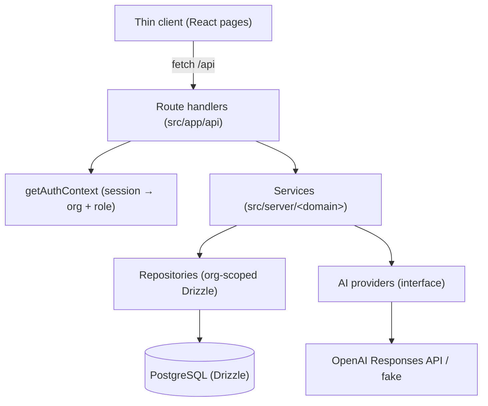
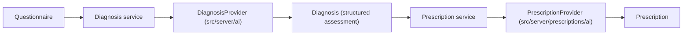

# 07 Implemented Architecture (Sprint 1)

This document describes the architecture **as actually implemented** in Sprint 1.
It supersedes the earlier aspirational architecture notes (which described a
FastAPI/Vue system); the delivered system is a single Next.js application.

## 1. Overview

Xerbs OS is a single **Next.js 16 (App Router)** application that serves both the
REST API (Route Handlers) and the thin-client UI. It is layered:

Dependencies point inward: route handlers depend on services; services depend on
repositories and provider interfaces; repositories depend on Drizzle. Nothing in
`src/server` imports HTTP or React.

## 2. Request lifecycle

1. A Route Handler (`src/app/api/**/route.ts`) receives the request.
2. `getAuthContext(req)` validates the session and resolves the caller's
   `{ userId, organizationId, membershipId, role }`.
3. The handler calls a **service** method with that context and the parsed input.
4. The service validates input (Zod), enforces authorization, applies business
   rules, and calls **repositories**.
5. Repositories run org-scoped Drizzle queries against PostgreSQL.
6. Domain errors (typed `AppError`s) are converted to JSON by `toErrorResponse`.

Route handlers are deliberately thin: auth → service → response mapping.

## 3. Layers

| Layer | Location | Responsibility |
|---|---|---|
| Route handlers | `src/app/api` | HTTP parsing, auth context, error mapping |
| Auth context | `src/server/auth/context.ts` | Session → organization + role (single seam) |
| Authorization | `src/server/auth/authz.ts` | Role policy (`assertCanWrite`), `AuthContext` |
| HTTP helpers | `src/server/http` | `AppError` hierarchy, `readJson`, `validate` |
| Services | `src/server/<domain>` | Validation, authz, business rules, cross-entity integrity |
| Repositories | `src/server/<domain>` | Pure, org-scoped data access |
| Data | `src/db` | Drizzle schema, client, seed; generated Better Auth schema |
| Migrations | `drizzle/` | drizzle-kit SQL migrations + snapshots |

Domains: `patients`, `visits`, `questionnaires`, `diagnoses`, `prescriptions`.

## 4. Multi-tenancy

- Every tenant-owned table carries `organization_id`.
- **Every** repository method is scoped by `organizationId`; a tenant can never
  read or write another tenant's rows.
- The active organization is resolved in exactly one place — `getAuthContext`.
  It comes solely from the authenticated **session** (`session.activeOrganizationId`,
  managed by the Better Auth organization plugin — see §5). `getAuthContext`
  then verifies the user is a member of that organization and returns their role.
  There is no client-provided organization header. Services never see how the
  org was chosen.

## 5. Authentication & authorization

- **Better Auth** (email/password) issues `HttpOnly`, `SameSite=Lax` cookie
  sessions. Its canonical `user`/`session`/`account`/`verification` tables are
  generated by its CLI into `src/db/auth-schema.ts`.
- **Organizations** are managed by the Better Auth **organization plugin**,
  mapped onto our existing `organizations`/`organization_members` (uuid) tables
  via `modelName` overrides (`advanced.database.generateId` returns uuids). It
  adds an `invitations` table and `session.active_organization_id`. It provides
  organization CRUD, membership, invitations, and set-active endpoints under
  `/api/auth/organization/*`, plus client hooks (`useListOrganizations`,
  `useActiveOrganization`, `organization.setActive`). On sign-in the active org
  defaults to the user's first membership.
- **Roles/access control** (`src/lib/permissions.ts`): owner/admin/practitioner/
  staff, built on the plugin's default org-management statements. Org-management
  permissions (invite/remove members) come from this access control; clinical
  write authorization stays in `assertCanWrite`.
- Reads are allowed for any organization member; clinical writes require role
  `owner`, `admin`, or `practitioner` (`staff` is read-only).

## 6. AI architecture

Two **independent** provider abstractions, each with an OpenAI (Responses API)
implementation and a deterministic `fake` implementation selected by the
`AI_PROVIDER` environment variable:

- The **diagnosis** service consumes only the questionnaire and returns a
  structured clinical assessment.
- The **prescription** service consumes only that structured assessment.
- The two AI layers are separate: the diagnosis AI knows nothing about
  prescriptions and vice versa. The OpenAI SDK is imported only inside the
  provider implementations.
- Both store the parsed `structuredResult` **and** the original `rawResponse`.
  Diagnoses and prescriptions are immutable; regeneration appends history.

## 7. Immutability & history

- **Diagnoses** and **prescriptions** are immutable. A visit may have many
  diagnoses; exactly one is `is_active` (enforced by a partial unique index).
  Only the active marker is mutable — clinical content never changes.
- **Questionnaires** are versioned (`schema_version`) so definitions can evolve
  without database migrations; validation always runs against the declared
  version.

## 8. Frontend

A thin client of React pages (`src/app`) that call the REST API via a small
`fetch` wrapper (`src/lib/api.ts`). No business logic or validation is duplicated
client-side. Authenticated routes are guarded by `AppShell`, which redirects to
`/login` when there is no session.

## 9. Data storage

- **PostgreSQL** — all persistent data (via Drizzle + postgres-js).
- **Redis** — provisioned via Docker Compose but not yet used.
